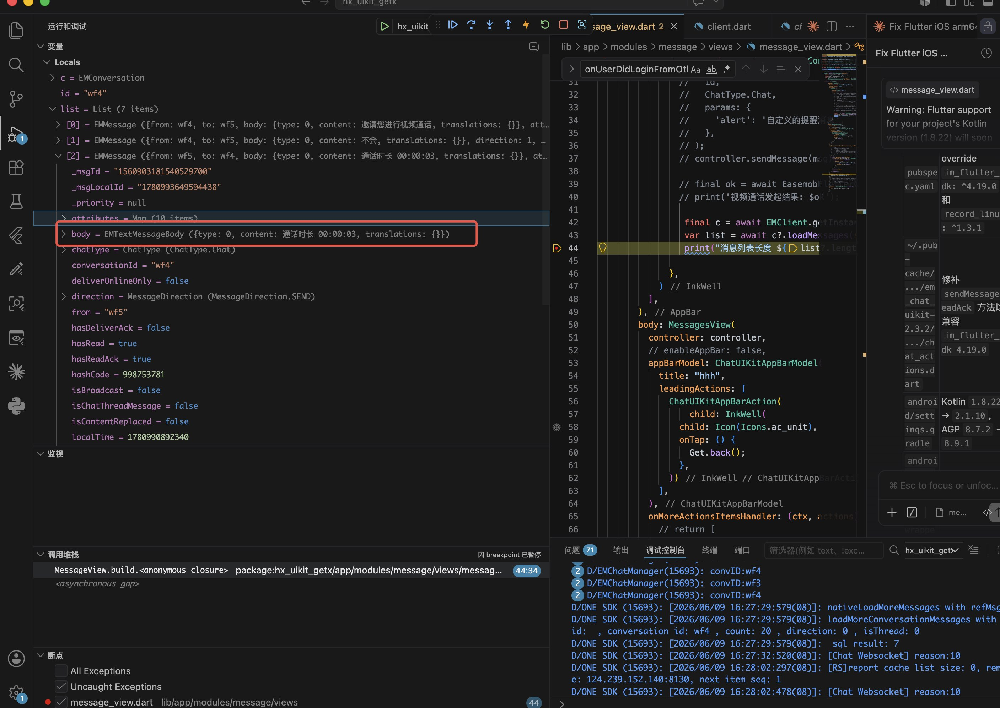
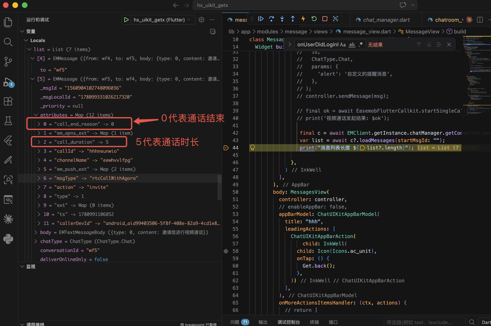

# easemob_flutter_callkit

[](https://pub.dev/packages/easemob_flutter_callkit)
[](https://github.com/easemob/easemob_flutter_callkit/blob/main/LICENSE)

**环信 Flutter 音视频通话插件**，基于环信 IM SDK 提供 1v1 单人通话和群组多人通话能力。

本插件是对原生 [EaseCallUIKit](https://doc.easemob.com/callkit/ios/integration.html)（iOS）和 [chat-call-kit](https://doc.easemob.com/callkit/android/integration.html)（Android）的 Flutter 封装，提供统一的 Dart API。

> **前置依赖**：本插件必须配合 [`im_flutter_sdk`](https://pub.dev/packages/im_flutter_sdk) 使用，通话前的 **IM 初始化**、**登录** 等操作均由 `im_flutter_sdk` 完成。

---

## 功能特性

- **1v1 语音 / 视频通话** — 点对点音频或视频呼叫
- **群组通话** — 多人音视频会议
- **通话事件流** — 实时监听呼叫、挂断、异常、远端用户加入/离开等事件
- **跨平台** — 一套 Dart API，底层由 iOS（Swift）与 Android（Kotlin）原生实现

## 环境要求

| 平台    | 最低版本               |
|---------|------------------------|
| iOS     | 15.0+                  |
| Android | API 24+（Android 7.0） |

---

## 安装

在项目的 `pubspec.yaml` 中同时添加 **`im_flutter_sdk`** 和 **`easemob_flutter_callkit`**：

```yaml
dependencies:
  im_flutter_sdk: ^4.19.1
  easemob_flutter_callkit: ^1.0.0
```

然后执行：

```bash
flutter pub get
```

### iOS 配置

1. **Podfile** 中确保部署目标不低于 `15.0`：

   ```ruby
   platform :ios, '15.0'
   ```

2. **权限声明** — 在 `ios/Runner/Info.plist` 中添加以下键值：

   ```xml
   <key>NSMicrophoneUsageDescription</key>
   <string>需要使用麦克风进行语音和视频通话</string>

   <key>NSCameraUsageDescription</key>
   <string>需要使用摄像头进行视频通话</string>

   <key>UIBackgroundModes</key>
   <array>
     <string>audio</string>
     <string>voip</string>
   </array>
   ```

3. 进入 `ios` 目录执行：

   ```bash
   cd ios && pod install
   ```

### Android 配置

1. **Java / Kotlin 兼容性** — 在 `android/app/build.gradle`（或 `.kts`）中设置 Java 17：

   ```gradle
   android {
       compileOptions {
           sourceCompatibility JavaVersion.VERSION_17
           targetCompatibility JavaVersion.VERSION_17
       }
       kotlinOptions {
           jvmTarget = '17'
       }
   }
   ```

2. **权限声明** — 在 `android/app/src/main/AndroidManifest.xml` 的 `<manifest>` 根节点下添加：

   ```xml
   <!-- 网络 -->
   <uses-permission android:name="android.permission.INTERNET" />
   <uses-permission android:name="android.permission.ACCESS_NETWORK_STATE" />
   <uses-permission android:name="android.permission.ACCESS_WIFI_STATE" />

   <!-- 音视频 -->
   <uses-permission android:name="android.permission.CAMERA" />
   <uses-permission android:name="android.permission.RECORD_AUDIO" />
   <uses-permission android:name="android.permission.MODIFY_AUDIO_SETTINGS" />

   <!-- 通知（Android 13+） -->
   <uses-permission android:name="android.permission.POST_NOTIFICATIONS" />
   <uses-permission android:name="android.permission.VIBRATE" />

   <!-- 锁屏 / 唤醒 -->
   <uses-permission android:name="android.permission.WAKE_LOCK" />
   <uses-permission android:name="android.permission.USE_FULL_SCREEN_INTENT" />
   <uses-permission android:name="android.permission.DISABLE_KEYGUARD" />

   <!-- 前台服务（Android 14+） -->
   <uses-permission android:name="android.permission.FOREGROUND_SERVICE" />
   <uses-permission android:name="android.permission.FOREGROUND_SERVICE_CAMERA" android:minSdkVersion="34" />
   <uses-permission android:name="android.permission.FOREGROUND_SERVICE_MICROPHONE" android:minSdkVersion="34" />
   <uses-permission android:name="android.permission.FOREGROUND_SERVICE_MEDIA_PLAYBACK" android:minSdkVersion="34" />
   <uses-permission android:name="android.permission.FOREGROUND_SERVICE_PHONE_CALL" />

   <!-- 通话相关 -->
   <uses-permission android:name="android.permission.MANAGE_OWN_CALLS" />
   <uses-permission android:name="android.permission.CALL_PHONE" />
   <uses-permission android:name="android.permission.READ_PHONE_STATE" />
   <uses-permission android:name="android.permission.READ_PHONE_NUMBERS" />

   <!-- 蓝牙 -->
   <uses-permission android:name="android.permission.BLUETOOTH" />
   <uses-permission android:name="android.permission.BLUETOOTH_CONNECT" />
   <uses-permission android:name="android.permission.BLUETOOTH_SCAN" />

   <!-- 可选硬件特性 -->
   <uses-feature android:name="android.hardware.telephony" android:required="false" />
   <uses-feature android:name="android.hardware.microphone" android:required="false" />
   ```

3. **注册 CallKit Activity** — 在 `<application>` 节点内添加：

   ```xml
   <activity
       android:name="com.hyphenate.easecallkit.ui.EaseVideoCallActivity"
       android:exported="false"
       android:launchMode="singleTask"
       android:screenOrientation="portrait"
       android:theme="@style/Theme.AppCompat.Light.NoActionBar" />

   <activity
       android:name="com.hyphenate.easecallkit.ui.EaseMultipleVideoActivity"
       android:exported="false"
       android:launchMode="singleTask"
       android:screenOrientation="portrait"
       android:theme="@style/Theme.AppCompat.Light.NoActionBar" />
   ```

---

## 快速开始

```dart
import 'package:flutter/material.dart';
import 'package:im_flutter_sdk/im_flutter_sdk.dart';
import 'package:easemob_flutter_callkit/easemob_flutter_callkit.dart';

class CallPage extends StatefulWidget {
  @override
  State<CallPage> createState() => _CallPageState();
}

class _CallPageState extends State<CallPage> {
  @override
  void initState() {
    super.initState();
    _initialize();
    _listenToCallEvents();
  }

  /// 步骤 1：使用 im_flutter_sdk 初始化环信 IM SDK
  Future<void> _initialize() async {
    final options = EMOptions.withAppKey('your-app-key');
    await EMClient.getInstance.init(options);
    print('IM SDK 初始化完成');
  }

  /// 步骤 2：初始化 CallKit（需在 IM 初始化之后调用）
  Future<void> _initCallKit() async {
    final config = CallKitConfig(callTimeout: 30);
    final ok = await EasemobFlutterCallkit.initCallKit(config);
    print('CallKit 初始化完成: $ok');
  }

  /// 步骤 3：使用 im_flutter_sdk 登录（token 需从应用服务端获取）
  Future<void> _login(String username, String token) async {
    await EMClient.getInstance.login(username, token, false);
    print('登录成功');
  }

  /// 步骤 4：监听通话事件
  void _listenToCallEvents() {
    EasemobFlutterCallkit.callEvents.listen((event) {
      final type = event['type'] as String?;
      final data = event['data'] as Map<String, dynamic>?;

      switch (type) {
        case 'onReceivedCall':
          print('收到来电: ${data?['caller']}');
          break;
        case 'onEndCallWithReason':
          print('通话结束: reason=${data?['reason']}, 时长=${data?['callTime']}秒');
          break;
        case 'onCallError':
          print('通话异常: ${data?['error']}');
          break;
        case 'onRemoteUserJoined':
          print('用户加入: ${data?['userId']}');
          break;
        case 'onRemoteUserLeft':
          print('用户离开: ${data?['userId']}');
          break;
      }
    });
  }

  /// 步骤 5a：发起 1v1 视频通话
  Future<void> _startVideoCall(String userId) async {
    final ok = await EasemobFlutterCallkit.startSingleCall(
      userId,
      callType: CallType.video,
    );
    print('视频通话发起结果: $ok');
  }

  /// 步骤 5b：发起 1v1 语音通话
  Future<void> _startVoiceCall(String userId) async {
    final ok = await EasemobFlutterCallkit.startSingleCall(userId);
    print('语音通话发起结果: $ok');
  }

  /// 步骤 5c：发起群组通话
  Future<void> _startGroupCall(String groupId) async {
    final ok = await EasemobFlutterCallkit.startGroupCall(groupId);
    print('群组通话发起结果: $ok');
  }

  /// 登出
  Future<void> _logout() async {
    await EasemobFlutterCallkit.logout();
  }

  @override
  Widget build(BuildContext context) {
    return Scaffold(
      appBar: AppBar(title: const Text('环信 CallKit')),
      body: Center(
        child: Column(
          mainAxisAlignment: MainAxisAlignment.center,
          children: [
            ElevatedButton(
              onPressed: _initCallKit,
              child: const Text('初始化 CallKit'),
            ),
            ElevatedButton(
              onPressed: () => _startVideoCall('target_user_id'),
              child: const Text('发起视频通话'),
            ),
            ElevatedButton(
              onPressed: _logout,
              child: const Text('登出'),
            ),
          ],
        ),
      ),
    );
  }
}
```

---

## API 说明

### 通话初始化

| 方法 | 说明 | 返回值 |
|------|------|--------|
| `initCallKit(config)` | 初始化 CallKit 模块。**必须在 `im_flutter_sdk` 初始化完成后调用。** | `Future<bool>` |

### 通话操作

| 方法 | 说明 | 返回值 |
|------|------|--------|
| `startSingleCall(userId, {callType, ext})` | 发起 1v1 通话。`callType` 默认为 `CallType.voice`（语音）。 | `Future<bool>` |
| `startGroupCall(groupId, {ext})` | 发起群组通话。 | `Future<bool>` |
| `logout()` | 登出当前用户并断开 IM 连接。 | `Future<bool>` |

### 通话事件

| 属性 | 说明 |
|------|------|
| `callEvents` | `Stream<Map<String, dynamic>>`，实时推送通话相关事件。 |

### 配置类

#### `CallKitConfig`

```dart
CallKitConfig(
  callTimeout: 30,               // 响铃超时时间（秒）
  incomingRingFile: 'ring.mp3',  // 自定义来电铃声（可选）
  outgoingRingFile: 'dial.mp3',  // 自定义去电回铃音（可选）
  dingRingFile: 'ding.mp3',      // 自定义提示音（可选）
)
```

#### `CallType`

- `CallType.voice` — 纯语音通话
- `CallType.video` — 视频通话

---

## 通话事件详解

`callEvents` 流推送的每条数据都是一个 `Map<String, dynamic>`，包含 `type`（事件类型）和 `data`（事件详情）：

| 事件类型 | 说明 | data 字段 |
|----------|------|-----------|
| `onReceivedCall` | 收到来电 | `userId`（呼叫方 ID）、`callType`（0=语音, 1=视频）、`ext`（扩展信息） |
| `onEndCallWithReason` | 通话结束 | `reason`（结束原因）、`callTime`（通话时长，秒） |
| `onCallError` | 通话异常 | `error`（错误描述）、`errorCode`（错误码） |
| `onRemoteUserJoined` | 远端用户加入 | `userId`（用户 ID）、`streamId`（流 ID） |
| `onRemoteUserLeft` | 远端用户离开 | `userId`（用户 ID）、`reason`（离开原因） |

---

## 注意事项

- **Token 获取**：生产环境中，Agora / 环信 Token 必须从**应用服务端**动态获取，禁止硬编码在客户端代码中。
- **初始化顺序**：必须先通过 `im_flutter_sdk` 完成 `EMClient.getInstance.init()`，再调用 `EasemobFlutterCallkit.initCallKit()`。
- **Android 14+**：前台服务权限（`FOREGROUND_SERVICE_CAMERA`、`FOREGROUND_SERVICE_MICROPHONE` 等）必须在 `AndroidManifest.xml` 中声明，否则通话页面可能无法正常唤起。
- **iOS 后台模式**：请在 Xcode 中开启 **Audio, AirPlay, and Picture in Picture** 以及 **Voice over IP** 后台模式（Signing & Capabilities → Background Modes）。

---

## 特殊说明

- 原生安卓callkit 和 原生iOScallkit对于音视频所产生的消息有所不同，需要注意
- 原生安卓callkit会在通话结束之后把数据直接写到文本内容里面

- iOS原生callkit通话结束把通话的状态放在消息的ext扩展里面

``` swift
CallEndReason: UInt {
    case hangup // 挂断通话
    case cancel // 取消呼叫
    case remoteCancel // 对方取消呼叫
    case refuse // 对方拒绝呼叫
    case remoteRefuse // 对方拒绝呼叫
    case busy // 忙碌
    case noResponse // 无响应
    case remoteNoResponse // 对方无响应
    case handleOnOtherDevice // 已在其他设备处理
    case abnormalEnd // 异常结束
}
```


---

## 示例项目

完整的可运行示例位于 [example](example/) 目录，演示了：

- IM SDK 初始化
- 登录 / 登出流程
- 1v1 语音、视频通话
- 群组通话
- 通话事件监听与展示

运行示例：

```bash
cd example
flutter run
```

---

## 相关文档

- [环信 iOS CallKit 集成文档](https://doc.easemob.com/callkit/ios/integration.html)
- [环信 Android CallKit 集成文档](https://doc.easemob.com/callkit/android/integration.html)
- [im_flutter_sdk（环信 Flutter IM SDK）](https://pub.dev/packages/im_flutter_sdk)

## 许可证

MIT
